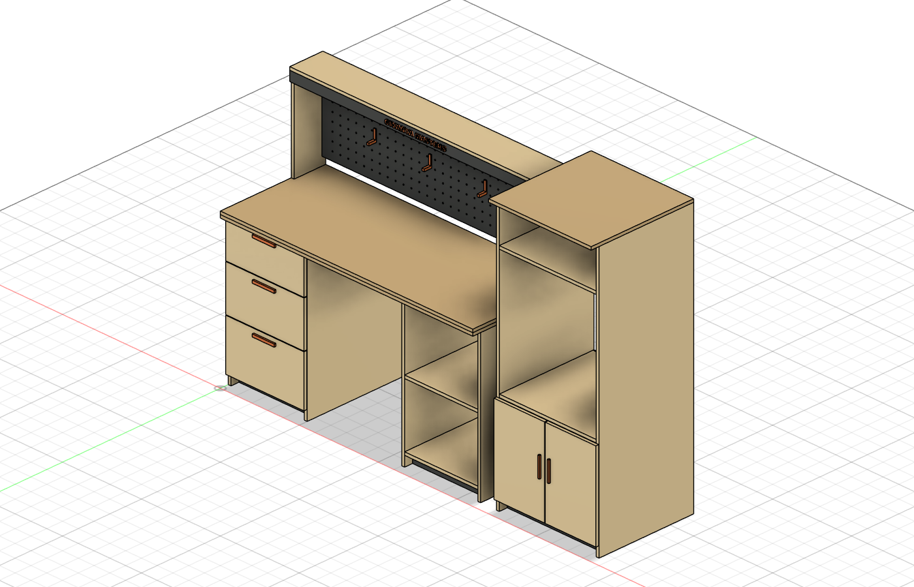
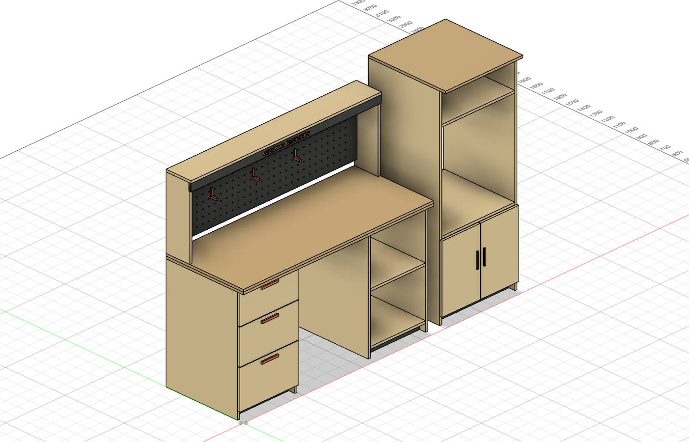
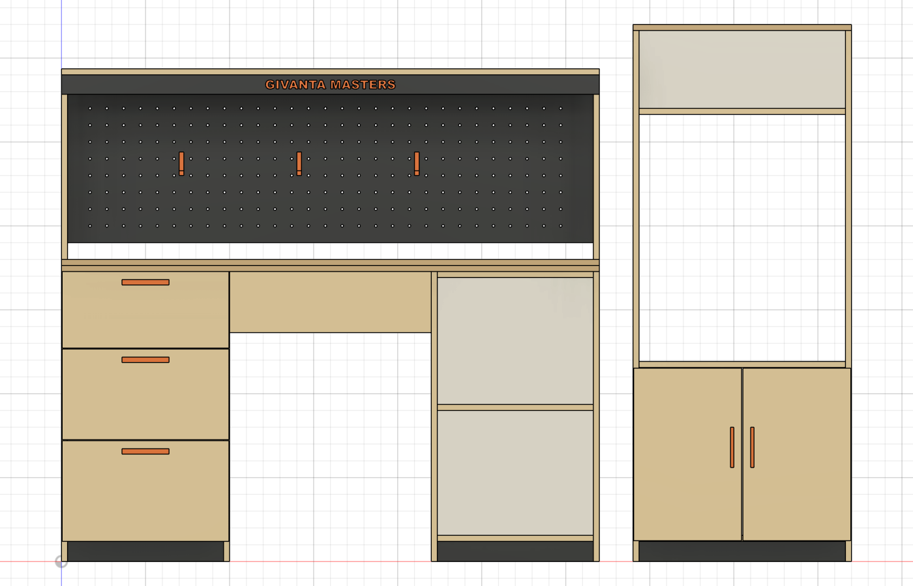
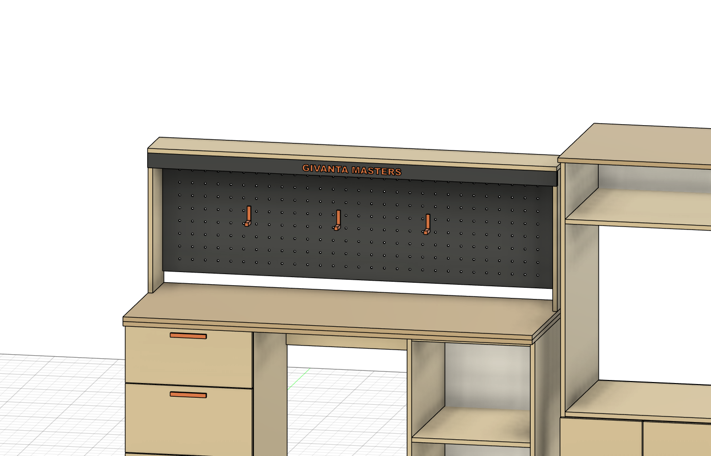
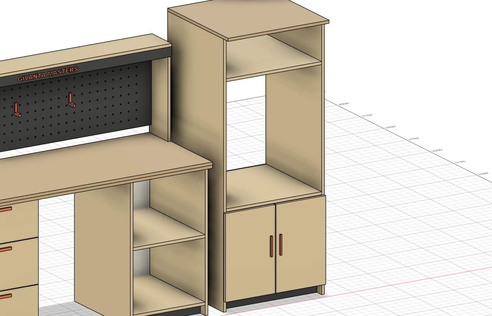
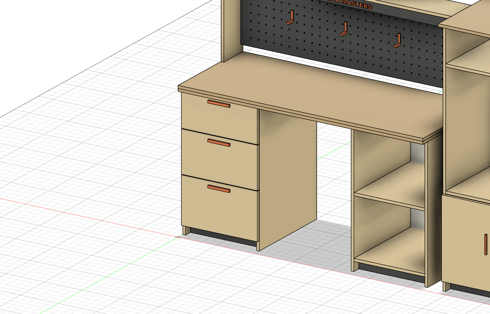

# WORKSHOP ONE — верстак инженера

**GIVANTA MASTERS** · мебель для тех, кто делает вещи руками

Рабочее место для инженера-мейкера, который **паяет, печатает на 3D-принтере,
красит и собирает**. Два независимых модуля из берёзовой фанеры 18 мм:
верстак с надстройкой и башня под 3D-принтер. Спроектировано в Fusion 360,
все детали — прямоугольный раскрой, собирается на конфирматы без станков с ЧПУ.

---

## Зоны

| Зона | Где | Что предусмотрено |
|---|---|---|
| Пайка | столешница под надстройкой | перфопанель под инструмент, полка под паяльную станцию и БП, экран под LED-подсветку рабочей зоны |
| Сборка | столешница 1600×650 | двойная плита 36 мм — не гуляет под ударами и струбцинами, вынос 50 мм спереди под струбцины |
| Покраска и расходники | открытая тумба справа | полка под краски, грунты и боксы; всё на расстоянии вытянутой руки |
| Мелочёвка и инструмент | тумба слева | три ящика: метизы, инструмент, электроника |
| 3D-печать | башня | площадка на высоте 596 мм под принтер до 614 мм шириной (Creality K2 встаёт), закрытый склад филамента снизу, полка сверху |

## Рендеры

| | |
|---|---|
|  |  |
|  |  |

## Габариты

- **Верстак**: 1600 × 650 мм, столешница на высоте 900 мм, с надстройкой — 1468 мм
- **Проём для ног**: 600 мм — можно работать сидя
- **Башня**: 650 × 650 × 1600 мм; проём под принтер 614 × 736 мм (Ш×В)
- Перфопанель: шаг отверстий 50 мм, Ø8 мм — под печатные крючки из комплекта

## Материалы

| Материал | Расход |
|---|---|
| Фанера берёза 18 мм, шлифованная | ~9,2 м² → 5 листов 1525×1525 (с запасом на раскрой) |
| ХДФ 6 мм (задники) + перфо-ХДФ | ~2 м² → 1 лист |
| PETG для печатных деталей | ~150 г |
| Конфирматы 7×50, шканты 8×40, петли накладные (2 шт), направляющие ящиков 550 мм (3 пары) | по месту |
| LED-лента 12 В тёплая + блок питания | 1,5 м под полкой надстройки |

Полная **карта раскроя**: [docs/cutlist.csv](docs/cutlist.csv) — 25 позиций,
все детали прямоугольные, парные детали учтены количеством.

## Печатные детали (PETG)

| Файл | Деталь | Кол-во |
|---|---|---|
| [print/drawer-pull-140mm.stl](print/drawer-pull-140mm.stl) | ручка ящика 140 мм | 3 |
| [print/door-pull-120mm.stl](print/door-pull-120mm.stl) | ручка двери 120 мм | 2 |
| [print/pegboard-hook-40mm.stl](print/pegboard-hook-40mm.stl) | крючок перфопанели, вылет 40 мм | 6+ |

Печатать PETG (ручки держат нагрузку и не боятся растворителей), плашмя,
без поддержек, заполнение 40 %.

## Сборка — порядок

1. **Тумбы верстака**: бока + дно + царги на конфирматы, цоколь, задник в паз
   или на гвозди. Левая тумба — установить направляющие до сборки короба.
2. **Столешница**: склеить два слоя 18 мм (ПВА + саморезы снизу через царги),
   положить на тумбы, закрепить через царги. Между тумбами — задняя связь.
3. **Надстройка**: щёки на столешницу (шканты + уголки к стене или столешнице),
   перфопанель между щеками, сверху полка и LED-экран. Лента клеится за экран.
4. **Ящики**: короба из фанеры 12–15 мм по внутренним размерам направляющих,
   фасады навесить с зазором 3 мм.
5. **Башня**: бока + дно + площадка + верхняя полка + крыша, задники, двери на
   накладные петли. Принтер ставить на резиновые ножки, филамент — вниз,
   в закрытый отсек (туда же силикагель).
6. Кромки — шлифовка P120→P240, масло-воск или полиуретановый лак в 2 слоя.

## CAD

- [cad/workshop-one-full.step](cad/workshop-one-full.step) — полная сборка (STEP)
- Модель построена скриптом через Fusion 360 API — все размеры параметрические

## Лицензия

CC BY 4.0 — стройте, дорабатывайте, делитесь. Указывайте авторство:
**GIVANTA MASTERS**.

---

*GIVANTA MASTERS · 2026*
